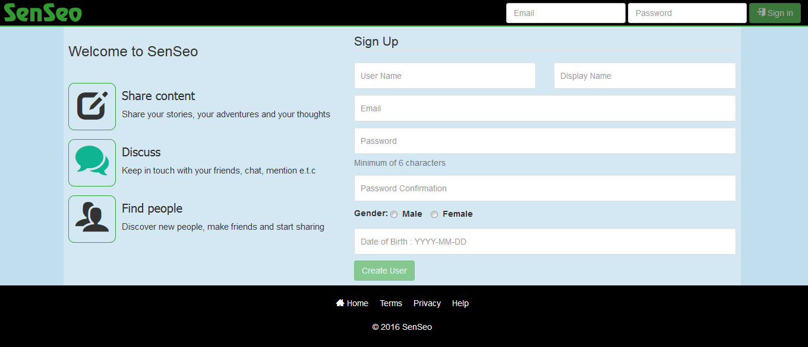
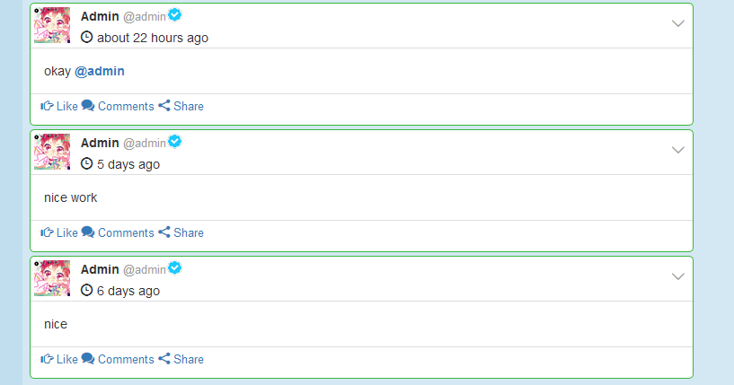

**SenSeo is a Social Networking Script which is currently under Developments. Its Built with [Fat-Free Framework](http://fatfreeframework.com/)**

# Installation

run `composer install` or `composer update` command from terminal or cmd

# Getting Started

open your site and visit `http://yourdomain/install`

Follow Steps and Done.

### Features :

* Profile Image Cover, Avatar Uploading
* Ajax Search
* Ajax Posting
* Validation
* Profile Card
* Mentions
* Hashtag
* Emoji
* Verified
* Reporting System
* Live Time Ago

### To do List

* Dashboard
* Chat
* Notification
* Friend Request
* Messages
* Live Notification,Friends Request,Chat
* Profile Edit
* Link Preview
* embed Video
* Poll
* Quick Edit
* Like
* Comments
* Share
* Group(Hash tag,People,Pages) Search

### Screen Shots

